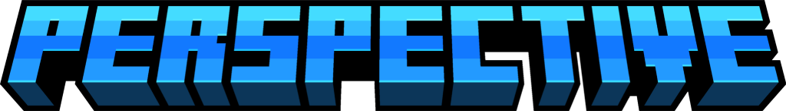

## About
Perspective is a Minecraft mod developed for Fabric/Quilt. It allows players to zoom, change and hold perspectives, have custom textures on named/random entities, take panoramic screenshots, and use super secret settings!

# Moved to [git.gay/Perspective/1.x](https://git.gay/Perspective/1.x).
2.x will be split into sub-mods, which will be located at [git.gay/Perspective](https://git.gay/Perspective).

---

Licensed under LGPL-3.0

**This mod is not affiliated with/endorsed by Mojang Studios or Microsoft.**  
Some game assets are property of Mojang Studios and fall under Minecraft EULA.  
